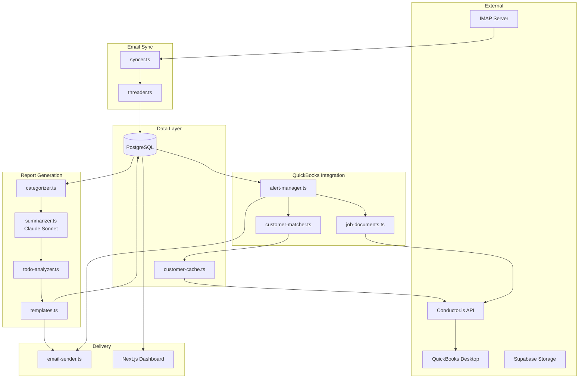
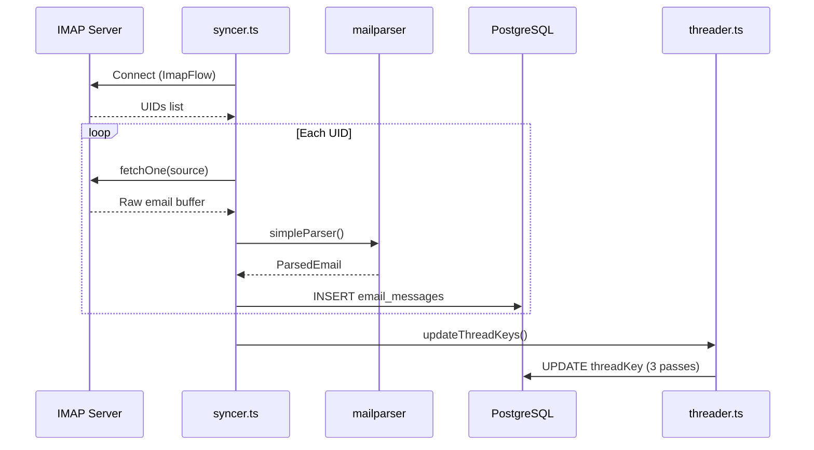
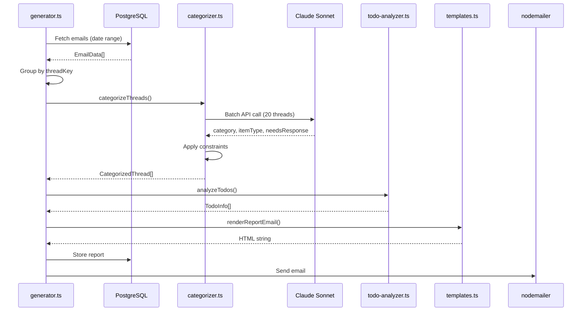
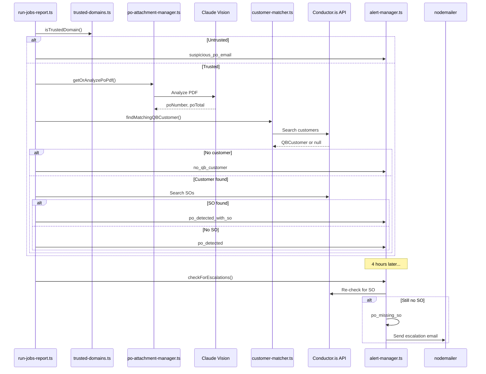

# MAS Email Reports - Codebase Map

> Auto-generated by Cartographer. Last mapped: 2026-02-03

## System Overview



This is a **3-stage pipeline system**:

1. **Email Sync (IMAP)** → Fetch emails → Thread grouping → Store to PostgreSQL
2. **Report Generation** → AI categorization → Todo detection → HTML email generation
3. **QuickBooks Integration** → PO detection → Customer matching → Alert escalation

## Directory Structure

```
src/
├── app/                    # Next.js web dashboard
│   ├── api/                # API routes
│   │   ├── generate-report/  # POST - sync + generate report
│   │   ├── reports/          # GET - list/view reports
│   │   ├── sync/             # POST - email sync only
│   │   ├── dismissed-threads/# POST/DELETE - thread dismissal
│   │   └── todos/            # PATCH - todo status updates
│   └── page.tsx            # Dashboard UI
├── components/ui/          # Shadcn UI components (badge, button, card)
├── db/                     # Database layer
│   ├── schema.ts           # Drizzle ORM schema (7 tables)
│   ├── index.ts            # DB connection
│   └── *.ts                # Debug/migration scripts
├── imap/                   # IMAP client
│   ├── client.ts           # Connection helpers
│   └── parsers.ts          # MIME parsing (mailparser)
├── sync/                   # Email synchronization
│   ├── syncer.ts           # Core sync logic
│   ├── threader.ts         # 3-pass thread grouping
│   └── run-sync.ts         # CLI entry
├── report/                 # Report generation
│   ├── generator.ts        # Main orchestrator
│   ├── categorizer.ts      # Thread categorization
│   ├── summarizer.ts       # AI prompts (Claude Sonnet)
│   ├── todo-analyzer.ts    # Action item detection
│   ├── templates.ts        # HTML email templates
│   ├── email-sender.ts     # Nodemailer SMTP
│   ├── po-detector.ts      # Fallback PO detection
│   ├── types.ts            # TypeScript interfaces
│   └── run-report.ts       # CLI entry
├── quickbooks/             # QuickBooks integration
│   ├── conductor-client.ts # Conductor.is REST API
│   ├── customer-matcher.ts # Fuzzy customer matching
│   ├── customer-cache.ts   # 24h TTL customer cache
│   ├── job-documents.ts    # SO/Invoice/Estimate fetching
│   ├── invoice-so-matcher.ts # LLM line item matching
│   ├── trusted-domains.ts  # Domain whitelist
│   ├── types.ts            # QB entity types
│   └── *.ts                # CLI scripts
├── jobs/                   # Alert system
│   ├── alert-manager.ts    # 2-stage alert lifecycle
│   ├── alert-templates.ts  # Alert email templates
│   └── run-jobs-report.ts  # CLI entry
├── storage/                # Optional Supabase storage
│   ├── supabase-client.ts  # Storage client
│   └── po-attachment-manager.ts # PO PDF caching
├── lib/utils.ts            # Tailwind class merging
└── utils/logger.ts         # Console logging
```

## Module Guide

### Database (`src/db/`)

**Purpose**: PostgreSQL schema management via Drizzle ORM

**Key Tables**:
| Table | Purpose |
|-------|---------|
| `email_messages` | Raw synced emails with threadKey |
| `daily_reports` | Generated reports (morning/midday/daily) |
| `report_threads` | Categorized thread summaries per report |
| `todo_items` | Action items (pending/resolved) |
| `dismissed_threads` | Manually dismissed threadKeys |
| `qb_sync_alerts` | QB sync alerts with 2-stage lifecycle |
| `email_po_attachments` | PO PDFs with cached analysis |

**Entry**: `src/db/schema.ts`

---

### Email Sync (`src/imap/`, `src/sync/`)

**Purpose**: Fetch emails from IMAP, parse MIME, group into threads

**Key Files**:
| File | Purpose |
|------|---------|
| `imap/client.ts` | IMAP connection config |
| `imap/parsers.ts` | mailparser wrapper |
| `sync/syncer.ts` | Core sync orchestration |
| `sync/threader.ts` | 3-pass threading algorithm |

**Threading Passes**:
1. **Message-ID/References**: Standard email threading
2. **In-Reply-To**: Fallback for broken headers
3. **Subject normalization**: Merges "RE: PO 1049" + "PO 1049"

**CLI**: `npm run sync`

---

### Report Generation (`src/report/`)

**Purpose**: AI-powered email categorization and HTML report generation

**Key Files**:
| File | Purpose | Tokens |
|------|---------|--------|
| `generator.ts` | Main orchestrator | 7,802 |
| `templates.ts` | HTML email templates | 7,254 |
| `summarizer.ts` | Claude API calls | 5,347 |
| `categorizer.ts` | Thread categorization | 5,258 |
| `todo-analyzer.ts` | Action item detection | 1,208 |

**Categories**:
- `customer` / `vendor` / `other`
- Item types: `po_received`, `po_sent`, `quote_request`, `rfq`, `general`

**Todo Types**:
- `po_unacknowledged`: Customer sent PO, no reply
- `quote_unanswered`: Quote request, no reply
- `general_unanswered`: Customer email, needs response
- `vendor_followup`: Vendor follow-up question

**CLI**: `npm run report`, `npm run report:morning`, `npm run report:midday`

---

### QuickBooks Integration (`src/quickbooks/`)

**Purpose**: Verify POs against QuickBooks Sales Orders via Conductor.is

**Key Files**:
| File | Purpose | Tokens |
|------|---------|--------|
| `customer-matcher.ts` | Fuzzy email→QB matching | 3,071 |
| `conductor-client.ts` | REST API wrapper | 2,640 |
| `job-documents.ts` | SO/Invoice fetching | 1,634 |
| `trusted-domains.ts` | Domain whitelist | 1,505 |
| `invoice-so-matcher.ts` | LLM line item matching | 1,306 |

**Customer Matching Confidence**:
- `exact`: Email matches exactly
- `high`: Name variations match
- `medium`: Fuzzy match ≥70%
- `low`: Domain matches company name

**CLI**: `npm run qb:test`, `npm run qb:refresh-customers`

---

### Jobs/Alerts (`src/jobs/`)

**Purpose**: 2-stage PO→QB sync alert system with escalation

**Alert Lifecycle**:
```
PO email → po_detected (Stage 1)
    ↓ [4 hours, no SO]
po_missing_so (Stage 2)
    ↓ [SO created]
Auto-resolved
```

**Alert Types**:
| Type | Trigger |
|------|---------|
| `po_detected` | New PO, no SO yet |
| `po_detected_with_so` | New PO, SO exists |
| `no_qb_customer` | Can't match to QB customer |
| `suspicious_po_email` | Untrusted domain |
| `po_missing_so` | 4+ hours, still no SO |
| `so_should_be_closed` | Fully invoiced, SO open |

**CLI**: `npm run jobs:check`, `npm run jobs:check -- --morning`

---

### Storage (`src/storage/`)

**Purpose**: Optional Supabase storage for PO PDF persistence

**Flow**:
1. Check cache in `email_po_attachments`
2. Fetch PDF from IMAP
3. Store to Supabase (if configured)
4. Analyze with Claude vision
5. Cache results in DB

**Supports**: PDF, DOCX (converted to PDF)

---

## Data Flow Diagrams

### Email Sync Flow



### Report Generation Flow



### QuickBooks Alert Flow



## Conventions

### Code Patterns
- **CLI-first**: Core logic in modules, thin CLI wrappers
- **Batch with fallback**: AI categorization tries batch, falls back to individual
- **Optional modules**: Supabase storage gracefully degrades if not configured

### Naming
- Files: `kebab-case.ts`
- Functions: `camelCase`
- Types: `PascalCase`
- DB tables: `snake_case`

### Email Templates
- **ALL styles inline** - email clients strip `<style>` tags
- Colors: Green (#059669) = PO Received, Purple (#7c3aed) = PO Sent, Blue (#2563eb) = RFQ

### Timezone
- All dates stored UTC, displayed in EST (`America/New_York`)
- CLI date args need time: `--date=2024-01-15T12:00:00`

## Gotchas

### IMAP
- **Never nest fetchOne in fetch loop** - causes hangs
- **SINCE search is date-only** - post-filter for precise datetime
- **References field** can be string OR array

### Threading
- Subject-based pass can merge unrelated threads if subjects too generic
- AI `relatedTo` merging requires validation

### Categorization
- Invoice/quote WE send → `customer` (exception to direction rule)
- `needsResponse`: AI distinguishes "thanks!" vs "thanks [PO attached]"
- Signature images ≠ real attachments

### Todos
- Two mechanisms: auto-resolve (email) + manual dismiss (persistent)
- Dismissal survives report regeneration

### QuickBooks
- Customer cache: 24h TTL, can be stale
- Fuzzy matching: "low" confidence = often false positive
- Escalation: 4 hours from alert creation, not email arrival

### PDFs
- IMAP returns base64 - check PDF magic number before decode
- DOCX needs LibreOffice installed
- Legacy .doc NOT supported

## Navigation Guide

### To add a new report type
1. Add type to `reportType` enum in `src/db/schema.ts`
2. Add date range logic in `src/report/generator.ts`
3. Add template section in `src/report/templates.ts`
4. Add CLI flag in `src/report/run-report.ts`

### To add a new alert type
1. Add to `alertType` enum in `src/db/schema.ts`
2. Add creation logic in `src/jobs/alert-manager.ts`
3. Add template in `src/jobs/alert-templates.ts`
4. Add detection in `src/jobs/run-jobs-report.ts`

### To modify thread categorization
1. Update AI prompt in `src/report/summarizer.ts`
2. Update constraints in `src/report/categorizer.ts`
3. Update labels in `src/report/templates.ts`

### To add a new API route
1. Create `src/app/api/<route>/route.ts`
2. Export `GET`/`POST`/`PATCH`/`DELETE` handlers
3. Use `db` from `src/db/index.ts`

### To modify the dashboard
1. Edit `src/app/page.tsx`
2. Components in `src/components/ui/`
3. Styles in `src/app/globals.css`

## Commands Reference

```bash
# Development
npm run dev              # Start Next.js server

# Email sync
npm run sync             # Fetch emails from IMAP

# Reports
npm run report           # Generate 4pm daily summary
npm run report:morning   # Generate 7am morning reminder
npm run report:midday    # Generate 12pm midday report
npm run report -- --preview  # Preview without sending

# QuickBooks
npm run qb:test          # Test QB connection
npm run qb:refresh-customers  # Force refresh customer cache

# Alerts
npm run jobs:check       # Run hourly alert check
npm run jobs:check -- --preview   # Preview without sending
npm run jobs:check -- --morning   # Morning review mode

# Database
npm run db:reset         # Clear all data (keeps dismissals)
```

## Environment Variables

| Variable | Required | Purpose |
|----------|----------|---------|
| `DATABASE_URL` | ✓ | PostgreSQL connection |
| `IMAP_HOST/PORT/USER/PASS` | ✓ | Email sync |
| `ANTHROPIC_API_KEY` | ✓ | Claude API |
| `REPORT_RECIPIENT` | ✓ | Report email recipient |
| `SMTP_HOST/PORT/USER/PASS/FROM` | ✓ | Email sending |
| `CONDUCTOR_API_KEY` | ✓ | QuickBooks via Conductor.is |
| `CONDUCTOR_END_USER_ID` | ✓ | QuickBooks user |
| `ALERT_RECIPIENT` | | QB alerts (defaults to REPORT_RECIPIENT) |
| `TRUSTED_DOMAINS` | | Manual domain whitelist |
| `SUPABASE_URL` | | PO PDF storage |
| `SUPABASE_SERVICE_ROLE_KEY` | | Supabase auth |
